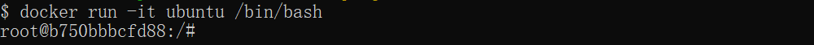
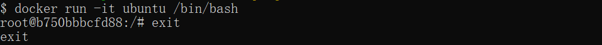

# 容器的使用
### 获取镜像
如果我们本地没有 ubuntu 镜像，我们可以使用 **docker pull** 命令来载入 ubuntu 镜像：
```shell
docker pull ubuntu
```

### 启动容器
以下命令使用 ubuntu 镜像启动一个容器，参数为以命令行模式进入该容器：
```shell
docker run -it ubuntu /bin/bash
```
参数说明：

- -i：交互式操作
- -t：终端
- ubuntu：ubuntu镜像
- /bin/bash：放在镜像名后的是命令，这里我们希望有个交互式Shell，因此用的是/bin/bash

要退出终端，直接输入**exit**：
```shell
root@ed09e4490c57:/# exit
```

